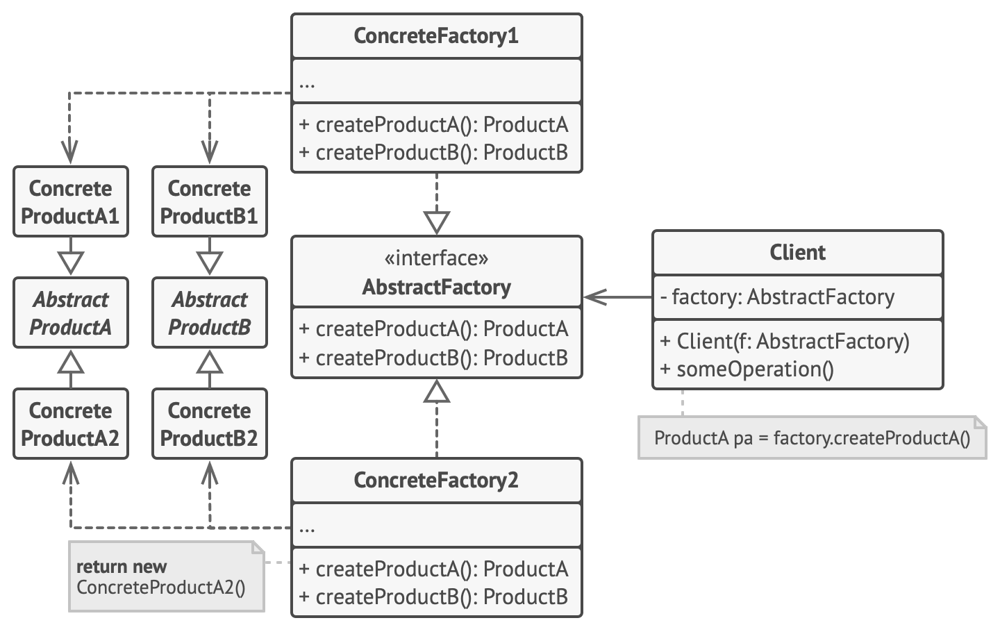
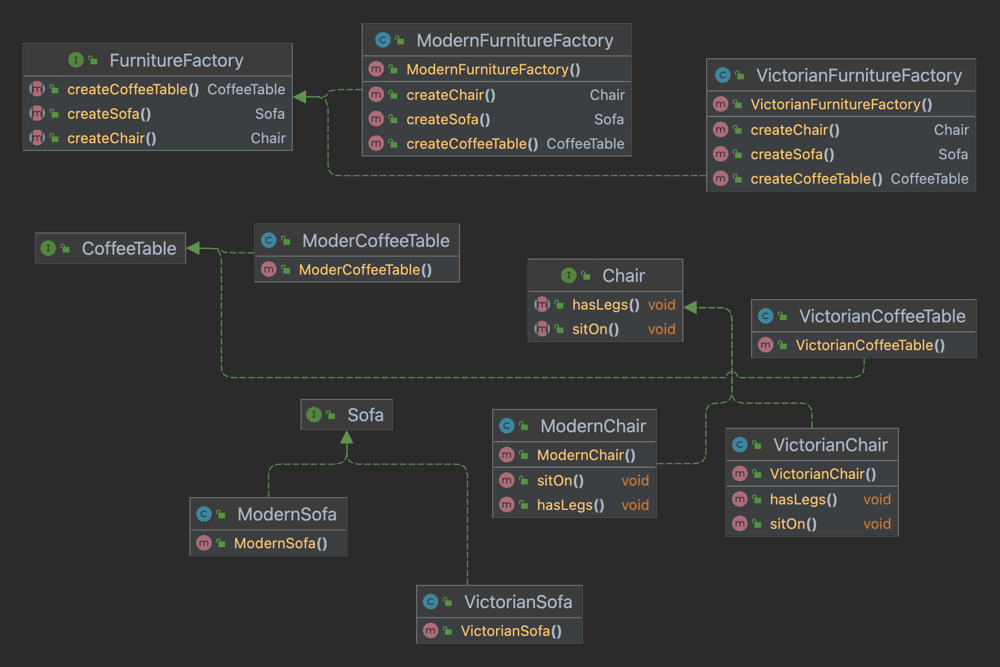

 - Creates families of related objects without specifying their concrete class.
 - Follows Single Responsibility, Open/Closed and Interface Segregation Principle.
 - The first thing the Abstract Factory pattern suggests is to explicitly declare interfaces for each distinct product of the product family (e.g., chair, sofa or coffee table). Then you can make all variants of products follow those interfaces.
 - The next move is to declare the Abstract Factory—an interface with a list of creation methods for all products that are part of the product family (for example, createChair, createSofa and createCoffeeTable). These methods must return abstract product types represented by the interfaces we extracted previously: Chair, Sofa, CoffeeTable and so on.
 - A factory is a class that returns products of a particular kind. For example, the ModernFurnitureFactory can only create ModernChair, ModernSofa and ModernCoffeeTable objects.
 - Structure
 - 
 - Example
 - 

 - Use the Abstract Factory when your code needs to work with various families of related products, but you don’t want it to depend on the concrete classes of those products—they might be unknown beforehand or you simply want to allow for future extensibility.
 - Consider implementing the Abstract Factory when you have a class with a set of Factory Methods that blur its primary responsibility.
 - 