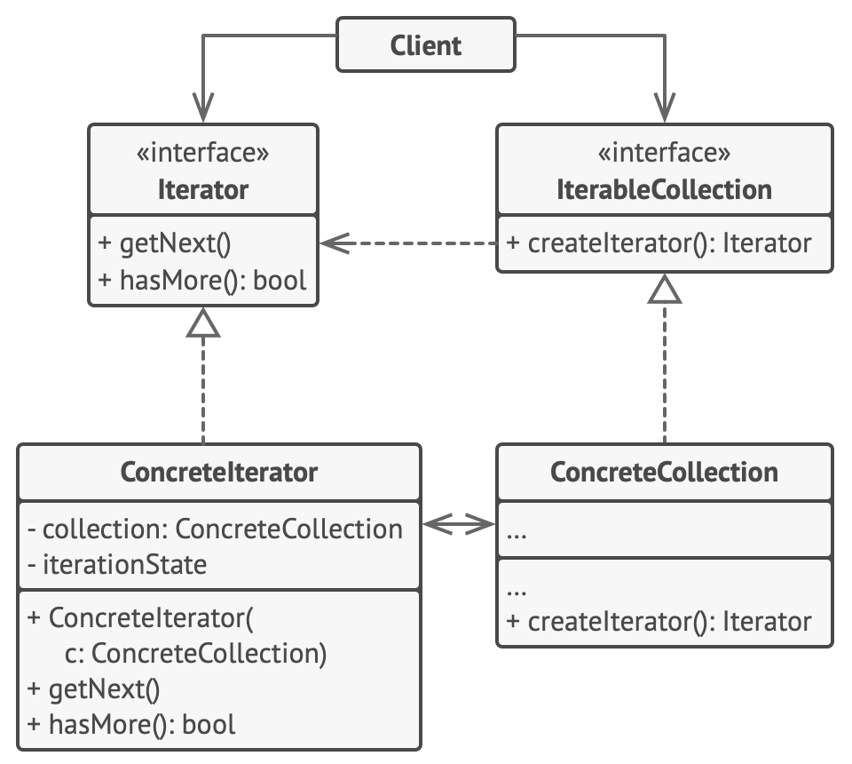
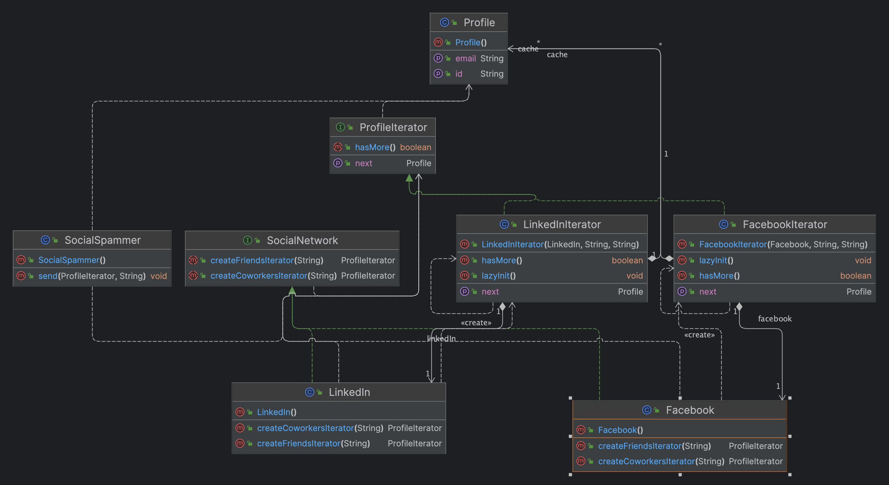

- Lets you traverse elements of a collection without exposing its underlying representation (list, stack, tree, etc.).
- Follows Single Responsibility and Open/Closed Principles.
- **structure**
- 
- **Example**
- 
-  Use the Iterator pattern when your collection has a complex data structure under the hood, but you want to hide its complexity from clients (either for convenience or security reasons).
- Use the pattern to reduce duplication of the traversal code across your app.
- Use the Iterator when you want your code to be able to traverse different data structures or when types of these structures are unknown beforehand.