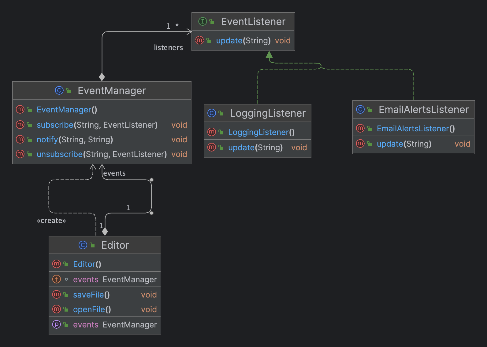

- Also known as Event-Subscriber/Listener.
- Define a subscription mechanism to notify multiple objects about any events that happen to the object they’re observing.
- Publisher Subscriber Pattern.
- Follows Single Responsibility and Open/Closed Principle.
- **Structure**
- 
- **Example**
- 