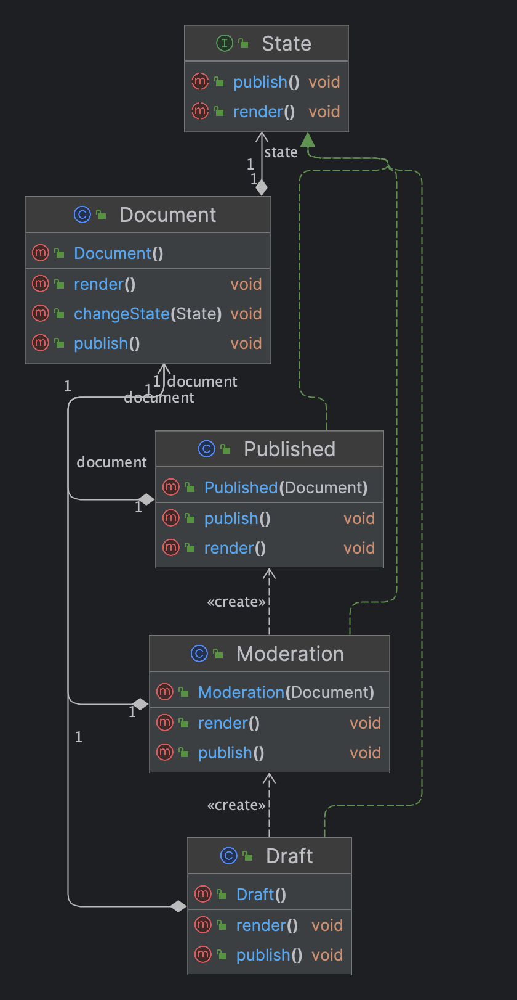

- Lets an object alter its behavior when its internal state changes. It appears as if the object changed its class.
**Problem**
- The biggest weakness of a state machine based on conditionals reveals itself once we start adding more and more states and state-dependent behaviors to the Document class. Most methods will contain monstrous conditionals that pick the proper behavior of a method according to the current state. Code like this is very difficult to maintain because any change to the transition logic may require changing state conditionals in every method.
**Solution**
- The State pattern suggests that you create new classes for all possible states of an object and extract all state-specific behaviors into these classes.
**Structure**
- 
- **Example**
- 