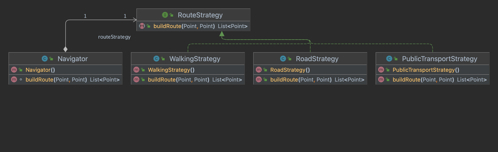

- Lets you define a family of algorithms, put each of them into a separate class, and make their objects interchangeable.
- Follows Single Responsibility, Open/Closed and Interface Segregation Principles.
- **Structure**
- 
- **Example**
- 