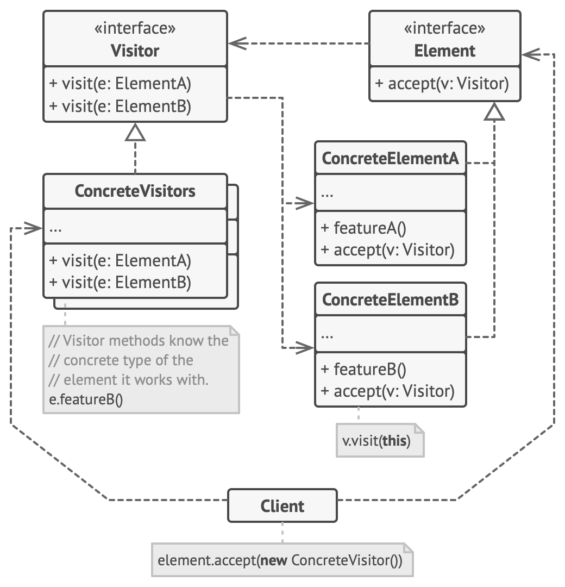
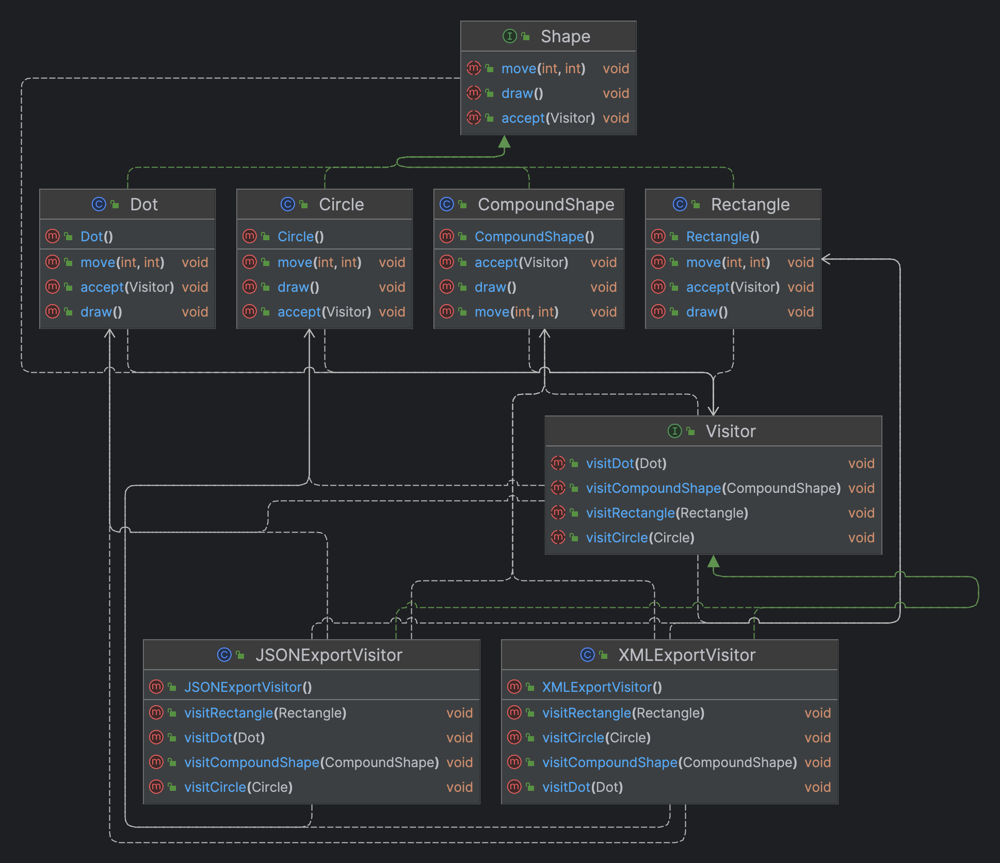

- Lets you separate algorithms from the objects on which they operate.
- The Visitor pattern suggests that you place the new behavior into a separate class called visitor, instead of trying to integrate it into existing classes. The original object that had to perform the behavior is now passed to one of the visitor’s methods as an argument, providing the method access to all necessary data contained within the object.

- The Visitor pattern addresses this problem. It uses a technique called Double Dispatch, which helps to execute the proper method on an object without cumbersome conditionals. Instead of letting the client select a proper version of the method to call, how about we delegate this choice to objects we’re passing to the visitor as an argument? Since the objects know their own classes, they’ll be able to pick a proper method on the visitor less awkwardly. They “accept” a visitor and tell it what visiting method should be executed.
- **Structure**
- 
- **Example**
- 
- Use the Visitor when you need to perform an operation on all elements of a complex object structure (for example, an object tree).
- Use the Visitor to clean up the business logic of auxiliary behaviors.
- Use the pattern when a behavior makes sense only in some classes of a class hierarchy, but not in others.
- Promotes Single Responsibility, Open/Closed and Interface Segregation principles.