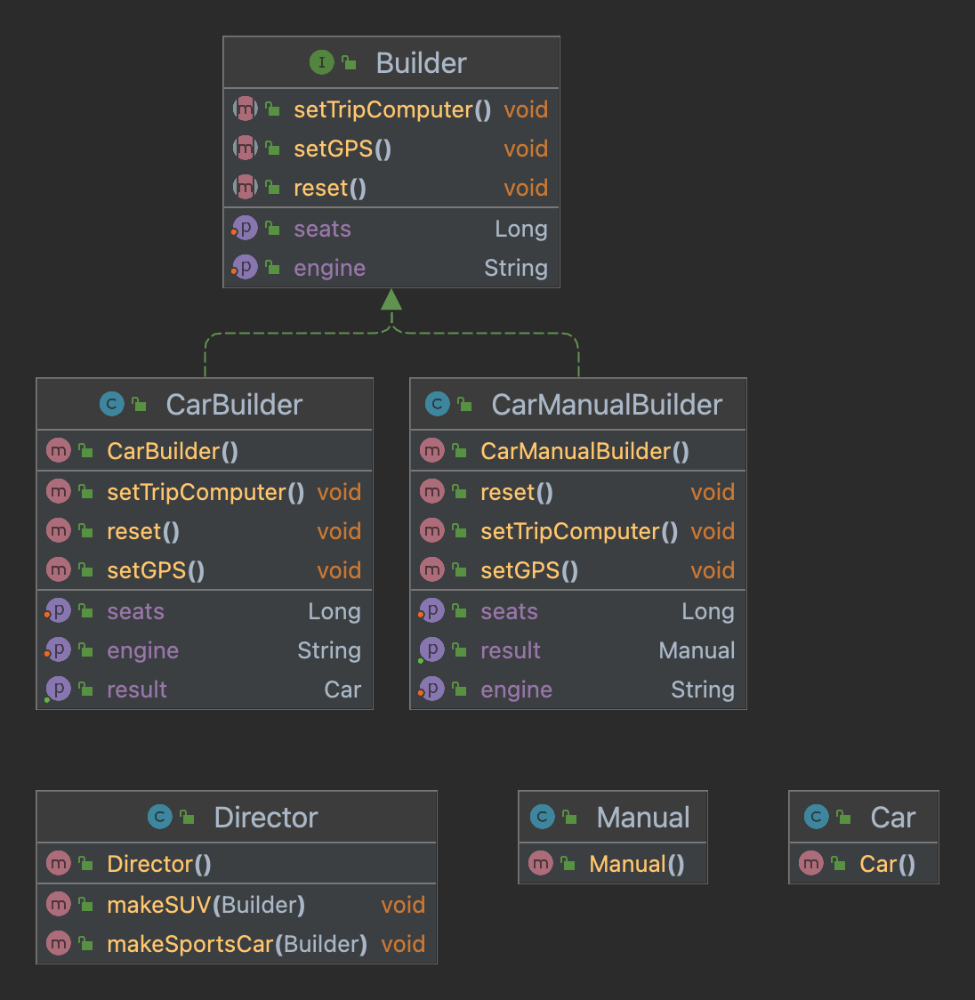

- Complex objects are built step by step.
- Eliminates Mota(Fat) constructors.
- Usage of Single Responsibility Principle.
- The Builder pattern suggests that you extract the object construction code out of its own class and move it to separate objects called **builders**.
- Structure
- 
- Example
- 

- Use the Builder pattern to get rid of a “telescoping constructor”.
- Use the Builder to construct Composite trees or other complex objects.
- Use the Builder pattern when you want your code to be able to create different representations of some product (for example, stone and wooden houses).