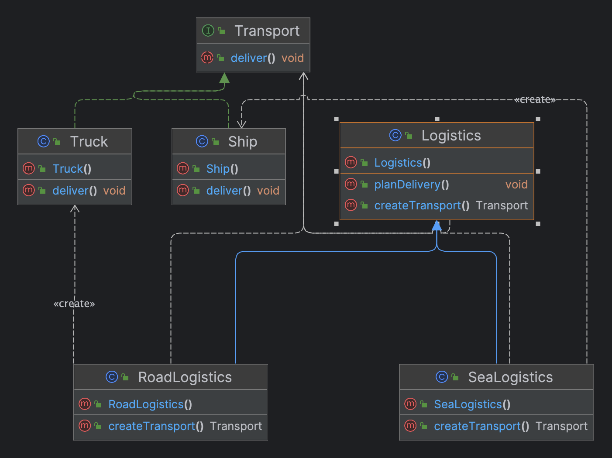

- Also called Virtual Constructor.

- Creates objects in Super Class but allows subclasses to alter the type of objects created.

- Can see usage of Interface Segregation Principle, Single Responsibility and Open/Closed Principle.

- Creates an object by calling a **Creational.Factory method**. The objects returned are called **Products**

- Creator decouples object creation from primary business logic.
- Structure

- Example

- Use the Creational.Factory Method when you don’t know beforehand the exact types and dependencies of the objects your code should work with.
- Use the Creational.Factory Method when you want to provide users of your library or framework with a way to extend its internal components.
-  Use the Creational.Factory Method when you want to save system resources by reusing existing objects instead of rebuilding them each time.

