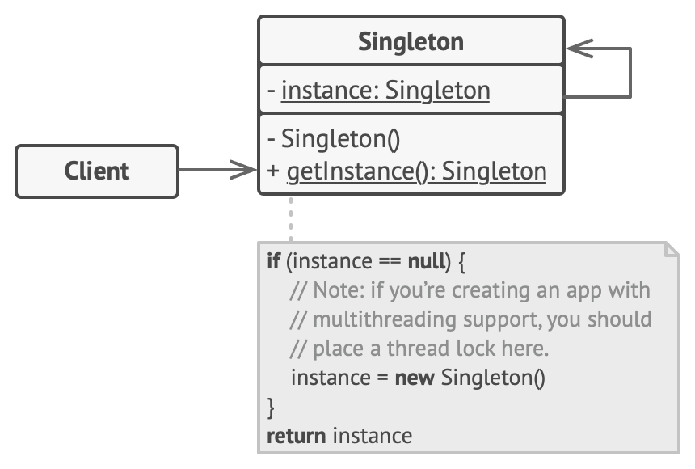
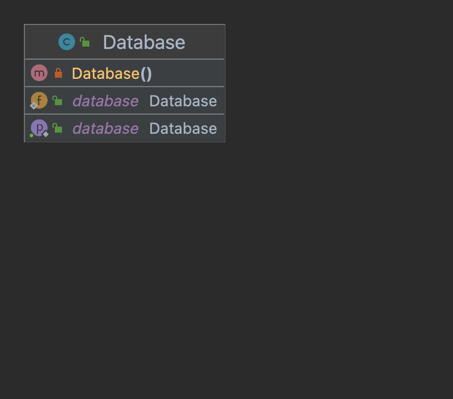

- Ensure that a class has only one instance, while providing a global access point to this instance.
- Violates Single Responsibility principle solving two problems.
  1. Single Instance creation.
  2. Provide global access point to the instance.
- structure (Private constructor and instance return method)
- 
- Example
- 
