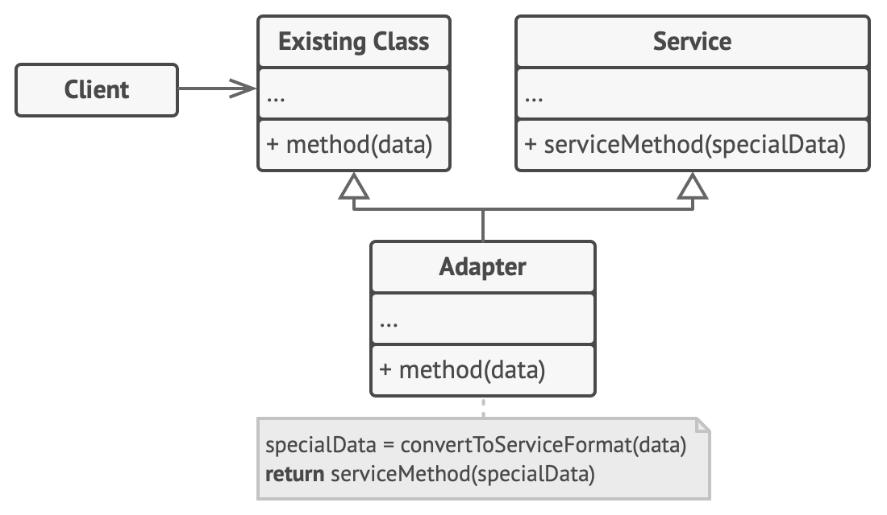
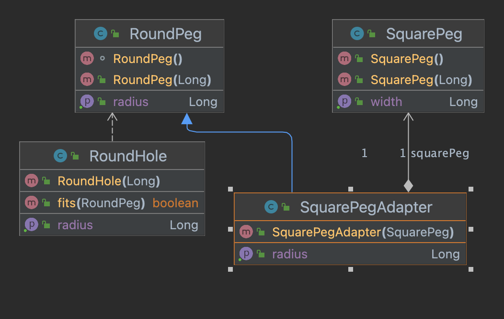

- Allows objects with incompatible interfaces to collaborate.
- Acts as an conversion/compatibility Adapter.
- Follows Single Responsibility and Open/Closed Principles.
- **Object Adapter Structure**
- 
- **Class Adapter Structure**
- 
- **Example**
- 
- Use the Adapter class when you want to use some existing class, but its interface isn’t compatible with the rest of your code.
- Use the pattern when you want to reuse several existing subclasses that lack some common functionality that can’t be added to the superclass.