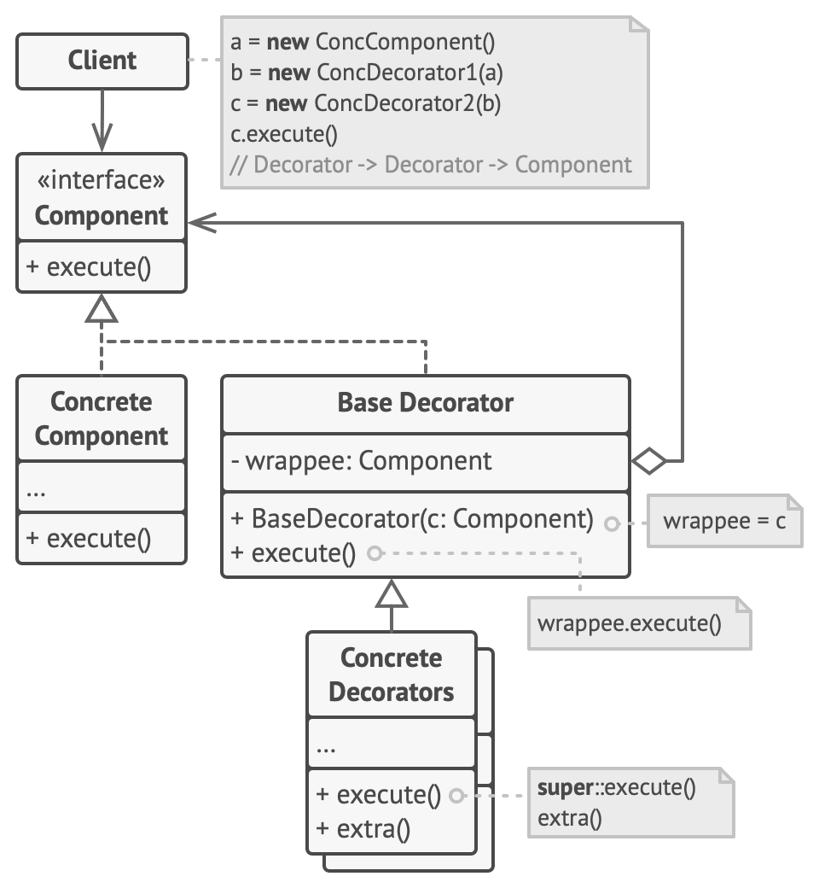
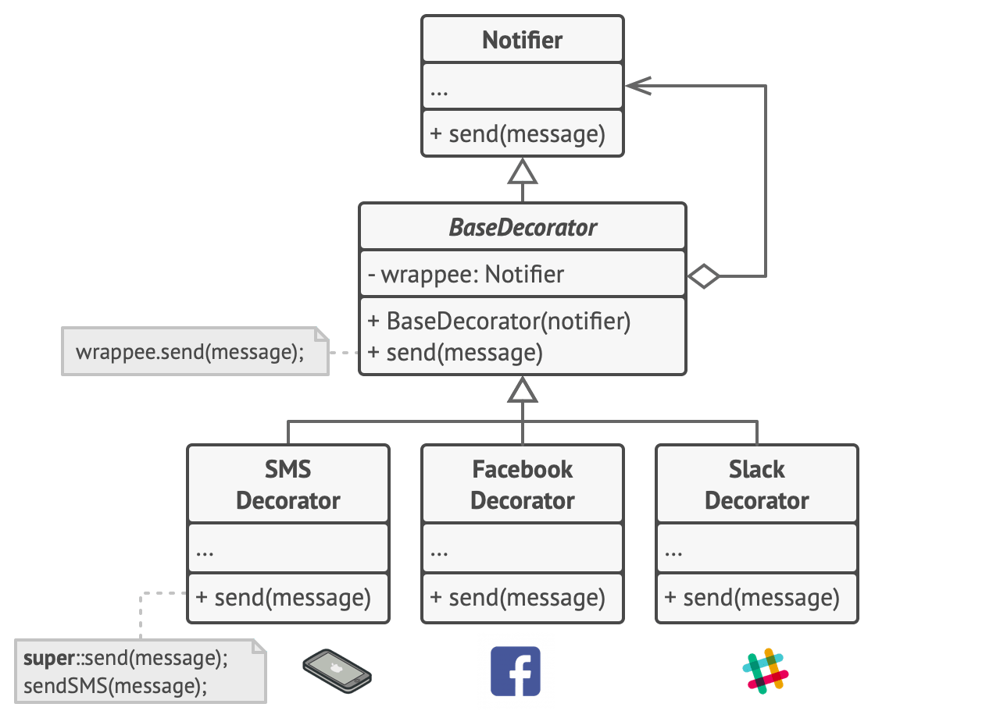
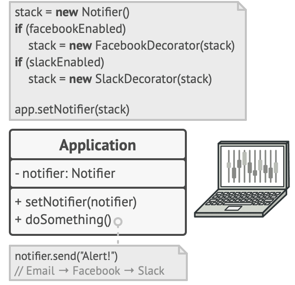

- Note: Inheritance is not a good solution if you want to change the behaviour of subclass or extend the behaviour of subclass dynamically. Composition/Aggregation which are inherent part of Decoration pattern are the best solutions in that usecase.
- Attach new behaviors to objects by placing these objects inside special wrapper objects that contain the behaviors.
- Creating all possible variations of classes by extending multiple of them causes bloating client code and increase complexity.
- Follows Single Responsibility Principle.
- Extending a class is the first thing that comes to mind when you need to alter an object’s behavior. However, inheritance has several serious caveats that you need to be aware of.

  1. Inheritance is static. You can’t alter the behavior of an existing object at runtime. You can only replace the whole object with another one that’s created from a different subclass.
  2. Subclasses can have just one parent class. In most languages, inheritance doesn’t let a class inherit behaviors of multiple classes at the same time.

  One of the ways to overcome these caveats is by using **Aggregation** or **Composition**
- Also called Wrapper pattern.
- **Structure**
- 
- Example
- 
- 
