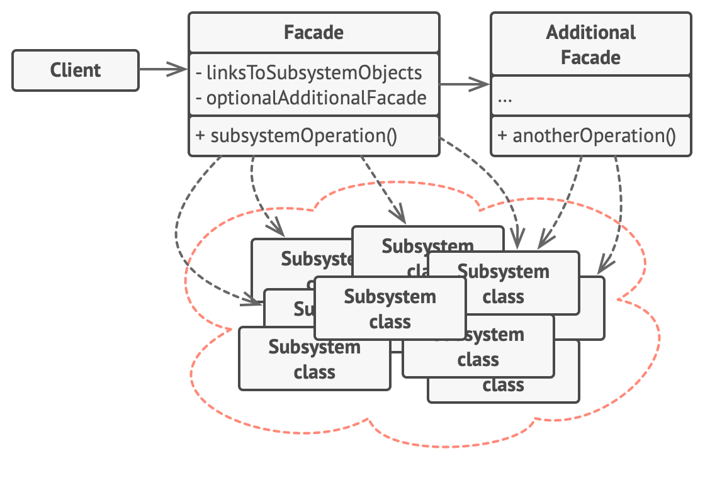

- Provides a simplified interface to a library, a framework, or any other complex set of classes.
- **Problem:** Imagine that you must make your code work with a broad set of objects that belong to a sophisticated library or framework. Ordinarily, you’d need to initialize all of those objects, keep track of dependencies, execute methods in the correct order, and so on.
As a result, the business logic of your classes would become tightly coupled to the implementation details of 3rd-party classes, making it hard to comprehend and maintain.
- Front/Face/PointOfContact/Interface
- **Structure**
- 
- **Example**
- 

